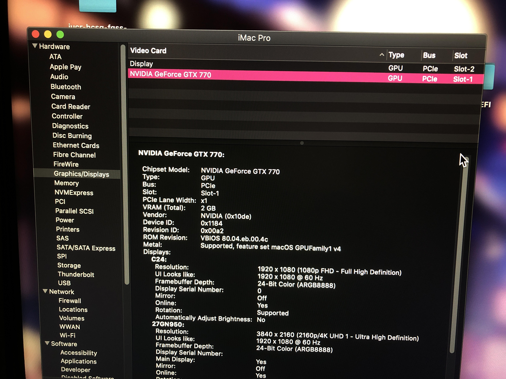
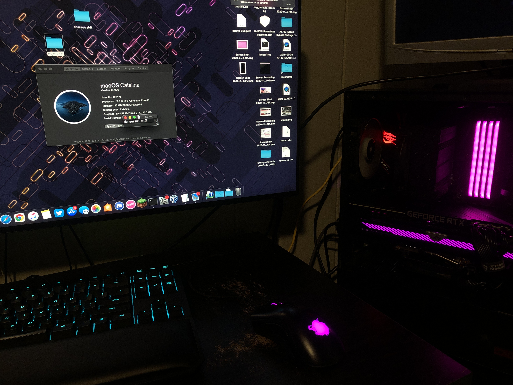

## How I made my GTX 770 work in my PC along my RTX 3080 to provide macOS compatibility
**If you end up doing anything from here, it is at your own risk and responsibility.**\
I will not be responsible for bad VBIOS flashes, earthquakes, universe implosion, etc.

## Introduction
Back on February 4th, I [upgraded my PC](https://github.com/ThatsNiceGuy/ThatsNiceGuy#pc-specs) with a Strix RTX 3080 OC which replaced my previous Vega 56. As you can imagine, this brought about a whole slew of compatibility problems for macOS. The biggest and most devastating one was that the RTX 3080 is not supported in any way in any version of macOS. This means no Web Drivers on High Sierra either. One workaround I used for a while was using macOS with a single monitor in VESA compatibility mode with 1080p resolution thanks to the UEFI GOP, but this was far from ideal. VESA compatibility mode means that there is no acceleration and the CPU must handle rendering tasks. Aside from this making the entire OS feel *extremely* sluggish, it also means that I can't use any macOS apps that use Metal. I had to find another, better solution.

## Kepler and macOS
As I use macOS quite a bit on my PC, I wanted to have full resolution, multimonitor and acceleration in macOS. I started digging around my house and project workspace and managed to find an [MSI Twin Frozr GTX 770 GAMING 2GB](https://www.msi.com/Graphics-Card/N770-TF-2GD5OC/Specification). This was great news as Kepler GPUs are natively supported in macOS since Mac OS X 10.8 Mountain Lion. These Kepler GPUs are still supported in the latest macOS Big Sur in order to support older Macs that still use this GPU architecture, which is convenient for us hackintoshers.

The GTX 770 was in extremely poor condition with sticky residue all over it and it was missing its shroud and fans. I decided to clean it up, give it some care since it was going to be in my main PC. I gave all of it a thourough wash, let it sit overnight, then tested it in my test bench.

It worked fine in there, booted windows fine and ran some games. Since it worked, I decided to buy the extra PCIe power cables that I need for my modular PSU (they cost eight dollars lol) and those arrived within two days.

Now, it was as easy as throwing it in my main PC and booting macOS, right?

Unfortunately, this is where I ran into some major problems.

## Dual GPU?
Now, I had some questions in the back of my mind about having an RTX 3080 and a GTX 770 in the same PC with the latest NVIDIA drivers. I ran the extra pcie power cables for the 770 (two eight pins) and got the GTX 770 all situated into my PC. ([You can see how it ended up looking here](https://twitter.com/thatsniceguy/status/1378241011621580802?s=21)).

Booting up Windows, everything surprisingly worked, including G-Sync on my main monitor. From here I decided to check out the 770 in Windows just to make sure I knew what I had and everything checked out fine as a proper GTX 770. I decided it was time for the moment of truth, so I shut down my PC, unplugged all the display cables from the 3080 and plugged them into the 770, and hit the power button.

*aaaaaaandd* my motherboard failed to POST...

## VBIOS, UEFI GOP, Flashing
After checking the beep code from the little piezo I attatched to my motherboard (and looking at the BIOS debug LEDs), it was a GPU firmware initialization issue. I thought that this wouldn't be a problem as all GTX 770s shipped with a UEFI-capable "hybrid" driver, but something was obviously off. As a troubleshooting measure, I would try plugging my tertiary display into the 3080 and leaving the other two in the 770. The motherboard POSTed and output to the monitor on the 3080 so I spammed F8 for boot menu. Choosing OpenCore, then choosing my Catalina partition, it started to boot, showing verbose on the monitor I had connected to the 3080. It was booting, booting, booting, then I saw WindowServer initialize and both of the displays I had connected to the GTX 770 woke up and started displaying my login background. A strange thing was that the display connected to the 3080 was still showing a (frozen) verbose screen even after windowserver started.

The issue though, was that I couldn't actually see the login screen, or *any* UI element except for the mouse. I only had a mouse I could move around. After talking with people, it was determined that macOS was treating the display connected to the 3080 as the primary monitor, which is an issue as its still frozen showing the verbose screen!

I rebooted a couple times thinking it would fix itself, but no dice. After trying for a while, I just shut down the PC, plugged all my displays into the 3080 again, powered on, and it succesfully POSTed and I chose to boot to Windows. From here, I decided that updating the VBIOS on the 770 would be my best course of action as maybe it was made more compatible or something. 

Next I downloded the latest x86_64 `nvflash` and [the latest VBIOS I could find for this card](https://www.techpowerup.com/vgabios/160720/msi-gtx770-2048-140530). Since I had two GPUs working in the system at the same time, I wasn't sure if `nvflash` would attempt to flash both cards, or randomly choose one of the two or something. 

I decided to RTFM which tought me about the `--list` and `-i` options, and here's what they do:
- `--list`
  - Lists the NVIDIA GPUs in your system
- `-i`
  - Enables you to choose what GPU to perform an action on

I also learned about `-6` which disables checks and pretty much allows you to flash any vbios to any card, but I recommend against using it and didn't use it here.

With an  output of `nvflash --list` on my PC ended up being something like this:
```
NVIDIA Firmware Update Utility <Version x.xxx>

NVIDIA display adapters present in system:
<0> GeForce GTX 770 (10DE,xxxx,xxxx,xxxx)
<1> GeForce RTX 3080 (10DE,xxxx,xxxx,xxxx)
```

Those numbers (`<0>` or `<1>`) before the GPU names are **index numbers**. In my case, the GTX 770 was index `0`. I took the VBIOS I downloaded from techpowerup, renamed it to `770.rom` <sup>(I know, not very descriptive but I understand it)</sup> and ran `nvflash`.

Remember that `-i` option from before? The syntax for it is basically this: `-iΣ`, where `Σ` is the index number. For me. since I wanted to flash the GTX 770, I would use `-i0`.

I flashed the VBIOS to the GTX 770 (I ran `nvflash -i0 770.rom`) and it all went well. After `nvflash` told me to restart, I restarted the PC (into Windows again) just to ensure it was working fine, and it was. GPU-Z reported the new vbios version and all was well. I decided to try macOS now since in my mind "its updated so it must work now". Doing the whole procedure with the display cables, it was ready. I pressed the power button...

*...*

*...*

*aaaaaaandd* it refused to post again. After this, I got extremely discouraged. Why wouldn't it work? It was the latest VBIOS I could find for the card! After complaining in the r/hackintosh server, someone told me about `GOP Updater`. After some intense googling (it was more like five minutes), I found [this thread](https://forums.guru3d.com/threads/display-port-gop-updater-guide-fix-blanking-screens-and-improve-monitor-compatibility.421417/) on Guru3D which linked [this thread](https://www.win-raid.com/t892f16-AMD-and-Nvidia-GOP-update-No-requests-DIY.html) on Win-Raid. I read the posts and started to get a general idea of how it works. 

Basically <sup>(More like extremely simplified, read first two posts on that Win-Raid thread for more detail)</sup>, this utility allows you to take a VBIOS, update the UEFI GOP inside of it, and save a modified/patched VBIOS.

**This is the part where I say that if you do this, it is at your own risk and responsibility**.

After downloading the utility and extracting it into a folder on my desktop called `gopupdate`, I looked at some of the batch files inside of it and found out that it requires Python 3.7 installed to `C:\Python37` and the `colourama` pip module installed from inside `C:\Python37\Scripts`. After getting those installed, I copied my `770.rom` vbios from before into the `gopupdate` folder for easy use. To update the GOP in it, I simply dragged the `770.rom` file onto the `GOPUpd.bat` batch file. If you did everthing correctly, it should show you the previous gop version and ask you if you want to update. Say yes, it'll do its thing and show you the updated version. Finish so the utility closes, and you should have a new file in the folder. For me it was named along the lines of `770-gopupdate.rom`. I could now take that VBIOS file and flash it onto my 770. (I ran `nvflash -i0 770-gopupdate.rom`). When it said it was done and asked me to reboot, I rebooted the PC but again into Windows to double check the new GOP updated VBIOS flashed correctly. After checking GPU-Z, the 770 was detected fine with the same version number VBIOS (but the GOP was still a newer version inside) so now I decided to shut down the PC for the moment of truth.

Unplugging all of the display cables from my 3080 and plugging them into the 770, then pressing the power button...

I heard that little POST beep from the beeper so I started spamming f8 for the boot menu...

*...*

then saw my main monitor wake from sleep...

and then show the BIOS screen. At this point I stopped spamming F8, it had already registered that I pressed it. Once the boot menu popped up, I chose OpenCore, then selected my Catalina partition. I saw the verbose output flying across the display, showing it succesfully booting up, then I knew I had succeeded when I saw WindowServer initialize and the login UI on my primary display.

I had been at this for over four hours straight at this point, and I was incredibly happy. I logged into my account, opened System Information, and there it was:


The GTX 770 fully working in macOS, driving all my displays and accelerating rendering. All I did here was check a few things, and I was finally done. It was finally working.

### Finally finished.


If you have questions or comments, [contact me](https://github.com/ThatsNiceGuy/ThatsNiceGuy#contact).